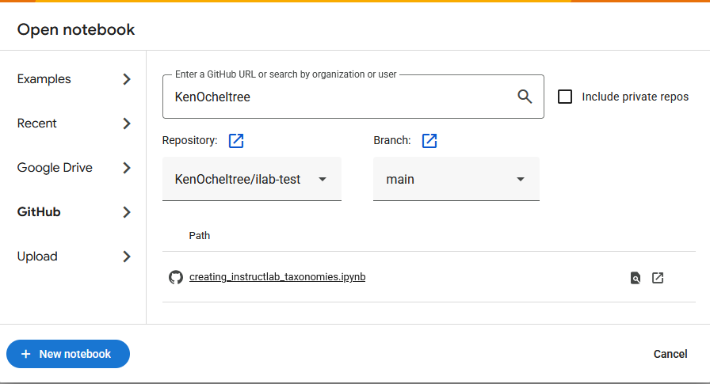
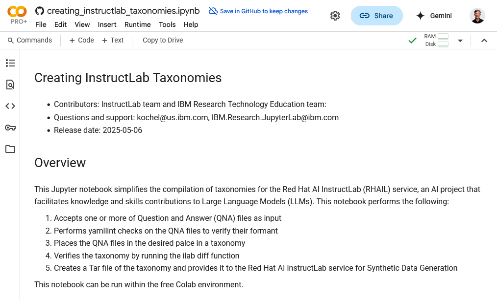
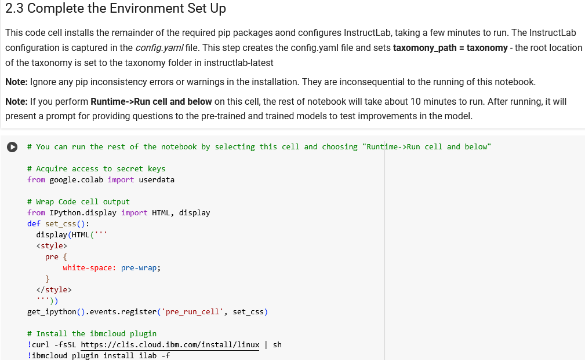
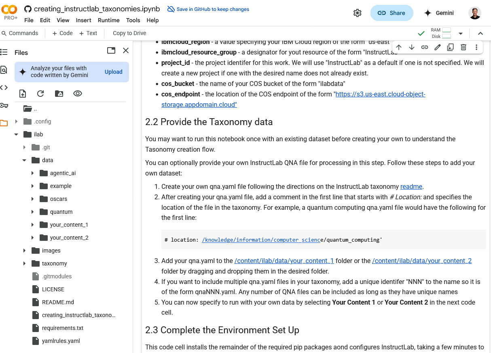

# Create Taxonomies for Red Hat AI Instructlab with a Jupyter Notebook
### By Kenneth Ocheltree

# Overview
This Jupyter notebook provides a template for constructing data taxonomies for the [Red Hat AI Instructlab service](https://cloud.ibm.com/instructlab/overview). The InstructLab method consists of three major components:
* **Taxonomy-driven data curation:**  The taxonomy is a set of training data curated by humans as examples of new knowledge and skills for the model.
* **Large-scale synthetic data generation:** A teacher model is used to generate new examples based on the seed training data. Since synthetic data can vary in quality, InstructLab adds an automated step to refine the example answers, ensuring they are grounded and safe.
* **Iterative model alignment tuning:** The model is retrained based on the synthetic data. The InstructLab method includes two tuning phases: knowledge tuning, followed by skill tuning.

The Jupyter notebook assists in the first step off constructing a taxonomy-based skill and knowledge representation.

# Steps

## Step 1. Open the Jupyter Notebook in Colab

1. Open [Google Colab](https://colab.research.google.com/).

2. If you already have a Google account, select it. If you do not have a Google account, click **Sign in** > **Create account**. Proceed though the steps to create a Google Account and then come back to the Google Colab and sign in with your Google account.

3. If you have used Google Colab before, click **File** > **Open**. If you have never used Google Colab before, the **Open Notebook** window opens automatically. 

4. Enter the details for this repo to open the notebook.

    a. Select the **Github** tab.

    b. For the organization, enter `KenOcheltree`.

    c. Select the `KenOcheltree/ilab-test` repository.

    

    d. Select the `creating_instructlab_taxonomies.jpynb` notebook.

    

## Step 2. Run the Notebook

You can either run the remainder of the notebook cell by cell by clicking the  **Run cell** button next to it or by selecting to run the following cell and below.

To run all the following cells at once, select the second code cell, shown with the arrow below, without running it, and click **Runtime->Run cell and below**.

The run does the following for you:
- Completes the environment setup by installing InstructLab and other required packages
- Configures the InstructLab installation
- Creates a taxonomy with the new data
- Uploads the taxonomy to the InstructLab service

After the run completes, you can make another run if desired. To do that, go back and either choose a different dataset or place different data in the `/content/ilab/data/your_content_1` folder or the `/content/ilab/data/your_content_2`. Then select the second code cell without running it and click **Runtime** -> **Run cell** and below to run the rest of the notebook. This creates and uploads a new taxonomy with the newly provided data.

# Summary and next steps

This tutorial demonstrated utilizing InstructLab for introducing AI data sets.

Click the **Folder** icon to explore the files in the `ilab` folder. Preloaded QNA files and synthetically generated questions and answers can be found in this directory tree. 

Try running the notebook with the other example data sets. After running through the InstructLab notebook, create your own QNA files.
