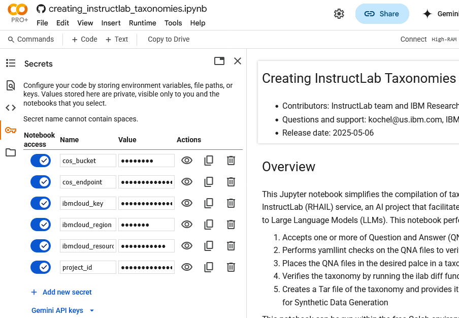

# Create Taxonomies for Red Hat AI Instructlab with a Jupyter Notebook
### By Kenneth Ocheltree

# Overview
This Jupyter notebook provides a template for constructing data taxonomies for the [Red Hat AI Instructlab service](https://cloud.ibm.com/instructlab/overview). The InstructLab method consists of three major components:
* **Taxonomy-driven data curation:**  The taxonomy is a set of training data curated by humans as examples of new knowledge and skills for the model.
* **Large-scale synthetic data generation:** A teacher model is used to generate new examples based on the seed training data. Since synthetic data can vary in quality, InstructLab adds an automated step to refine the example answers, ensuring they are grounded and safe.
* **Iterative model alignment tuning:** The model is retrained based on the synthetic data. The InstructLab method includes two tuning phases: knowledge tuning, followed by skill tuning.

The Jupyter notebook assists in ther first step off constructing a taxonomy-based skill and knowledge representation.

# Steps

## Step 1. Open the Jupyter Notebook in Colab

1. Select a Google Account to use with Colab. 

2. If you do not have a Google account, choose Sign in and on the Sign In page, select Create account at the lower right. Proceed though the steps to create a Google Account and then come back to the [Colab Sign In page](https://colab.research.google.com/) and sign in with your Google account.

3. Select File->Open notebook and choose Github on the left side. Enter “KenOcheltree” for the GitHub URL. Select the KenOcheltree/ilab-test repository

4. At this point, Select the notebook named running_instructlab_on_gpu.jpynb and it will open into Colab.

## Step 2. Run the first cell to perform pre-reset installs
1. Run the first code cell by clicking the arrow next to it. On first selecting to run the cell, dismiss the warning with **Run anyway.**

2. The cell will complete and give a list of data options to use to create the taxonomy.

## Step 3. Place your Access Credentials in Colab Secrets

When you configured IBM Cloud and COS access for the Red Hat AI InstructLab service, you created resource IDs and an access key that you need to provide to upload your taxonomy to the Red Hat AI InstructLab service. You will need to give the notebook access to these parameters:

- ibmcloud_key - a key to access your IBM Cloud account of the form "XX_XXXXXXXXXXXXXXXXXX"
- ibmcloud_region - a value specifying your IBM Cloud region of the form "us-east"
- ibmcloud_resource_group - a designator for yout resource of the form "InstructLab"
- project_id - the project identifer for this work. We will use "InstructLab" as a default if one is not specified. We will create a new project if one with the desired name does not already exist.
- cos_bucket - the name of your COS bucket of the form "ilabdata"
- cos_endpoint - the location of the COS endpoint of the form "https://s3.us-east.cloud-object-storage.appdomain.cloud"

You do this by setting the parameters in the Colab secrets area, accessed by selecting the key icon on the left as shown below.

## Step 4. Provide the Taxonomy data

You may want to run this notebook once with an existing taxonomy dataset before creating your own to understand the tasonomy creation flow. 

You can optionally provide your own InstructLab QNA files for processing in this step. Follow these steps to add your own dataset:

1. Create your own qna.yaml file following the directions on the InstructLab taxonomy readme.
2. After creating your qna.yaml file, add a comment in the first line that starts with # Location: and specifies the location of the file in the taxonomy. For example, a quantum computing qna.yaml file would have the following for the first line:

    "# location: /knowledge/information/computer_science/quantum_computing"

3. Add your qna.yaml to the /content/ilab/data/your_content_1 folder or the /content/ilab/data/your_content_2 folder by dragging and dropping them in the desired folder.
4. If you want to include multiple qna.yaml files in your taxonomy, add a unique identifer "NNN" to the name so it is of the form qnaNNN.yaml. Any number of QNA files can be included as long as they have unique names
5. You can now specify to run with your own data by selecting Your Content 1 or Your Content 2 in the next code cell.

## Step 5. Run the remainder of the notebook

You can either run the remainder of the notebook cell by cell or by selecting to run the following cell and below.

To run all the following cells at once, select the second code cell, shown with the arrow below, without running it, and click on **Runtime->Run cell and below** to run the rest of the notebook.

The run will proceed as follows to create an InstructLab taxonomy and upload it to the Red Hat AI Instructlab service:
- Complete the environment setup by installing InstructLab and other required packages
- Configure the InstructLab installation
- Create a taxonomy with the new data
- Upload the taxonomy to the RH AI InstructLab service

After the model is created, you can choose to run inferencing on the model or download the trained model

- Optionally opens an inferencing dialogue with untrained and trained models
- Optionally downloads the trained model

After the run completes, you can make another run if desired. To do that, go back and either choose a different dataset or place different data in the /content/ilab/data/your_content_1 folder or the /content/ilab/data/your_content_2. Then select the second code cell without running it and click on Runtime->Run cell and below to run the rest of the notebook. This will create and upload a new taxonomy with the newly provided data.

# Summary and next steps

This Tutorial demonstrated utilizing InstructLab for introducing datasets, data generation and model training. This notebook produced an InstructLab trained model that was available for inferencing and downloading.

Click on the Folder icon on the left to explore the files in the ilab folder. Preloaded QNA files and synthetically generated questions and answers can be found in this directory tree. 

Try running the notebook with the other example data sets. After running through the InstructLab notebook, you are encouraged to create your own QNA file as described in Step 5.
